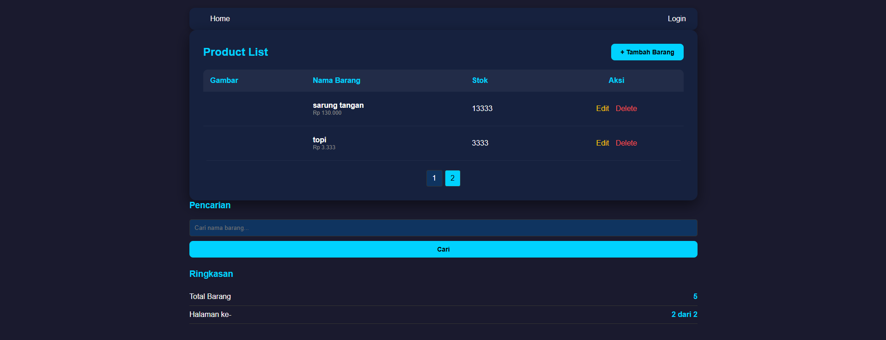
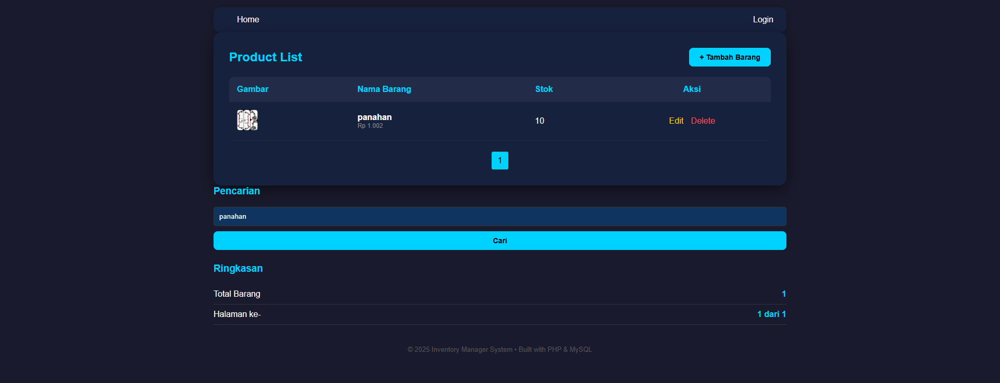
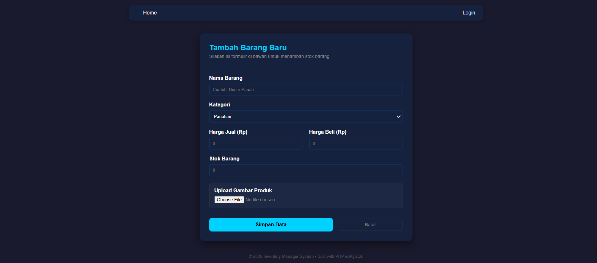

Tentu, Muhammad Aziz. Saya telah menyusun ulang **README.md** Anda agar lebih profesional, kompleks, dan yang paling penting, saya sudah menyediakan **placeholder (ruang khusus)** yang jelas untuk Anda menempelkan hasil *screenshot* di setiap fitur utama.

Silakan salin kode di bawah ini untuk file `README.md` Anda:

---

# 📊 Inventory Management System - Pro Dashboard

### 🎓 Laporan Tugas Praktikum Pemrograman Web 1

**Identitas Mahasiswa:**

* **Universitas**: Universitas Pelita Bangsa

* **Nama**: Muhammad Aziz Tri Ramadhan

* **NIM**: 312410380

* **PRODI**: INFORMATIKA

* **Kelas**: T1.24.A3

* **Dosen**: Agung Nugroho, S.Kom., M.Kom.

---

## 📝 Deskripsi Proyek

Aplikasi ini adalah sistem manajemen inventaris barang modern yang dibangun menggunakan **PHP Native** dan **MySQL**. Fokus utama pengembangan ini adalah penggabungan teknik **Pagination** untuk efisiensi data dan **Searchbar** untuk kemudahan navigasi, dibalut dengan antarmuka **Dark Mode Dashboard**.

---

## 🚀 Fitur Utama & Penjelasan Teknis

### 1. 📑 Fitur Pagination (Maksimal 3 List)

Berdasarkan tugas **Praktikum 13**, sistem ini membatasi tampilan data agar tidak menumpuk dalam satu halaman.

* **Konfigurasi**: Variabel `$per_page` diatur bernilai **3**.
* **Logika**: Menggunakan klausa `LIMIT` dan `OFFSET` pada query SQL.
* **Navigasi**: Link halaman tetap membawa parameter pencarian (`q`) sehingga data tidak hilang saat berpindah page.

> **📸 PAGINATION (HALAMAN 1 & 2):**
> 
> ---
> 
> 

### 2. 🔍 Fitur Searchbar (Sidebar System)

Sesuai dengan **Praktikum 14**, fitur ini memungkinkan pencarian barang secara spesifik.

* **Posisi**: Diletakkan pada **Sidebar** sebelah kanan untuk menjaga estetika tabel utama.
* **Mekanisme**: Menggunakan metode `GET` dengan klausa `LIKE %...%` pada query database.

> **📸 FITUR PENCARIAN:**
> 
> ---
> 
> 

### 3. ➕ Management Data (CRUD)

Sistem mendukung penuh pengelolaan data barang, mulai dari penambahan hingga penghapusan.

* **Tambah Barang**: Form input dengan dukungan upload gambar otomatis ke folder `img/`.
* **Aksi**: Tombol Edit dan Delete yang terintegrasi di setiap baris tabel.

> **📸 FORM TAMBAH BARANG:**
> 
> ---
> 
> 

## 🛠️ Struktur Database & Kode

Aplikasi ini menggunakan tabel `data_barang` dengan struktur:

* `id` (Primary Key, AI)
* `nama`, `kategori`, `harga_jual`, `harga_beli`, `stok`, `gambar`

### Cuplikan Logika Pagination & Search (Fix):

```php
$per_page = 3; 
$sql_where = !empty($q) ? " WHERE nama LIKE '{$q}%'" : "";
$sql = "SELECT * FROM data_barang" . $sql_where . " LIMIT {$offset}, {$per_page}";

```

---

## 📂 Struktur Direktori Proyek

* `index.php` - Dashboard Utama (Paging & Search)
* `tambah.php` - Form Tambah Data (UI Elegan)
* `koneksi.php` - Koneksi Database
* `css/style.css` - Custom Dark Mode & Grid Layout
* `img/` - Penyimpanan Gambar Produk

---

*© 2025 - Muhammad Aziz Tri Ramadhan | Universitas Pelita Bangsa*

---
